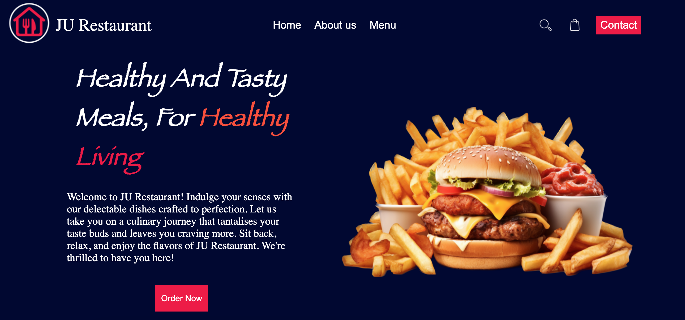
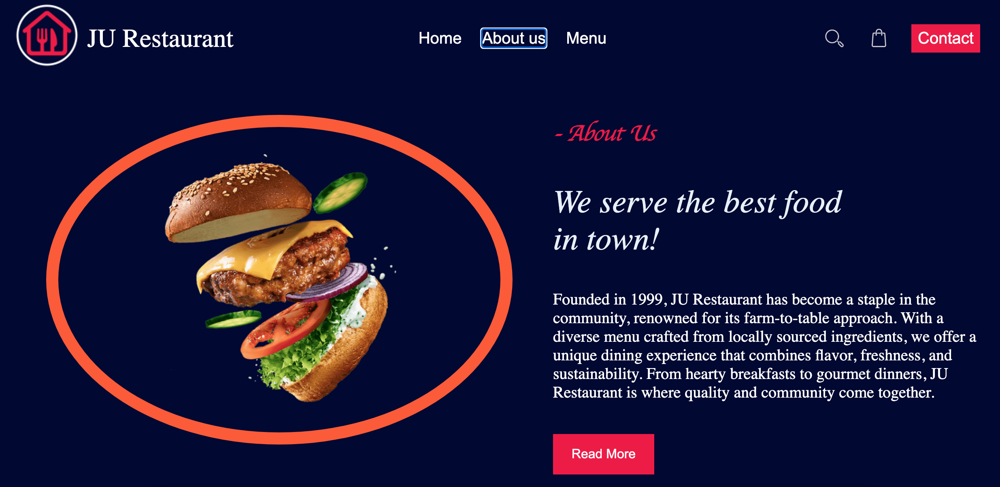
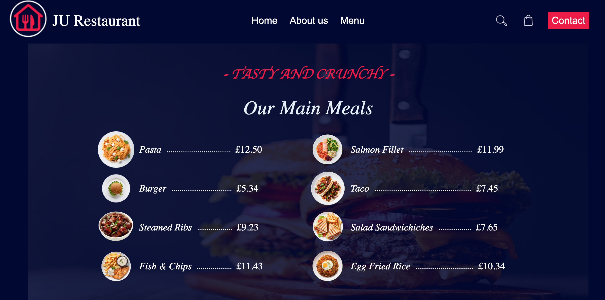

# Restaurant-Page

## Preview

## Introduction

This project creates a restaurant homepage using JavaScript to dynamically generate content. It uses Webpack to manage the project structure and bundle modules. The HTML includes a navigation bar and a content area where different tabs ("Home," "About Us," and "Menu") can be displayed via JavaScript. This project is part of [The Odin Project](https://www.theodinproject.com/lessons/node-path-javascript-restaurant-page)'s curriculum.

# Technologies Used

- HTML
- CSS
- JavaScript

## Prerequisites

- You need a modern web browser that supports HTML and CSS.
- [Node.js](https://nodejs.org/)
- npm (Node Package Manager), usually included with Node.js

## Installation

Clone this repository to your local machine or download the ZIP file and extract it to a local folder. Open the index.html file in your web browser.

## Credits

This project is created by [Jathusan08](https://github.com/Jathusan08). If you have any questions or suggestions, feel free to open an issue.

## License

This project is licensed under the [MIT License](LICENSE). Feel free to use, modify, and distribute the code.
